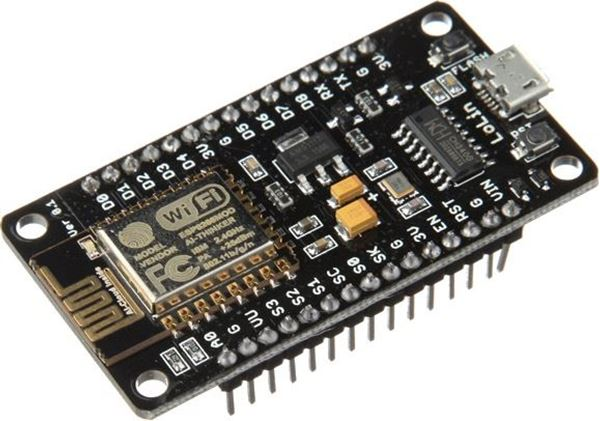
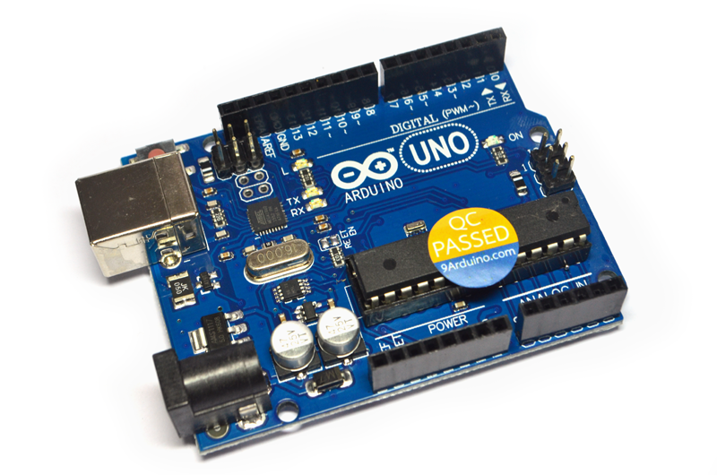
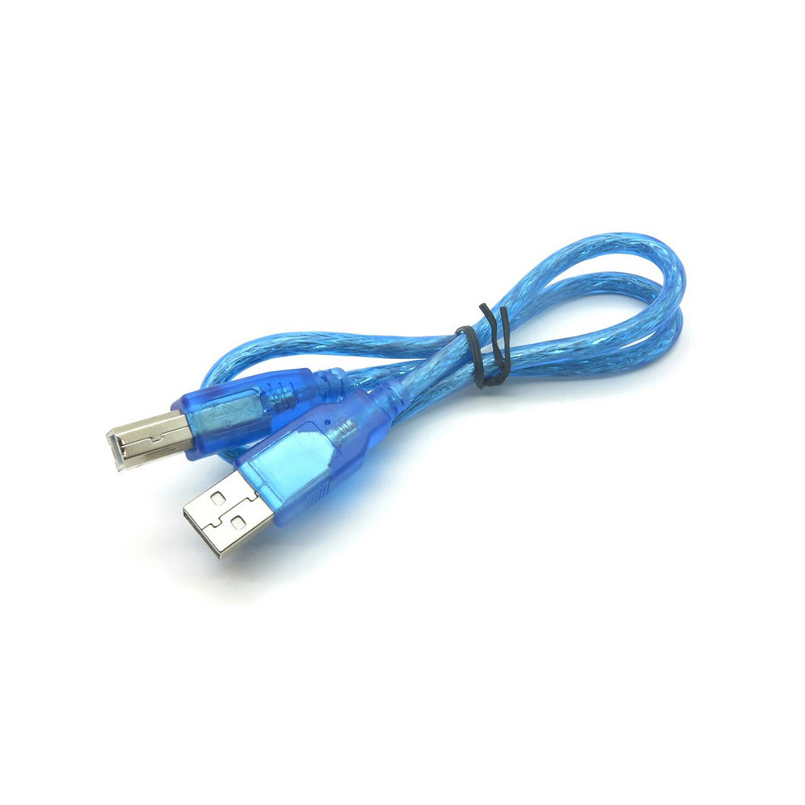
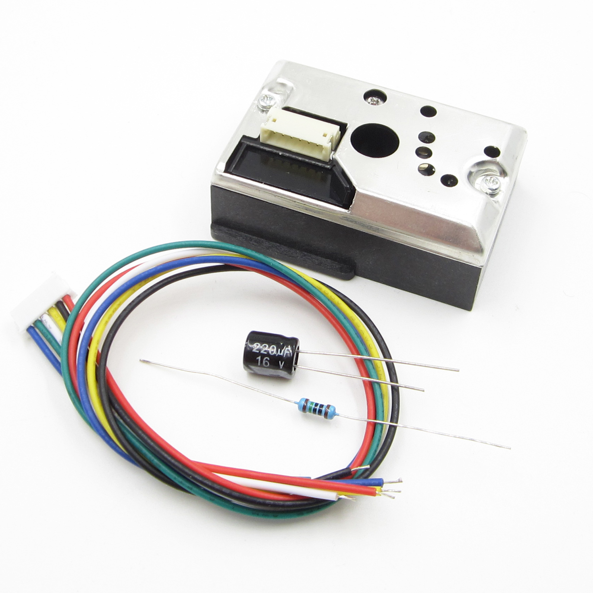
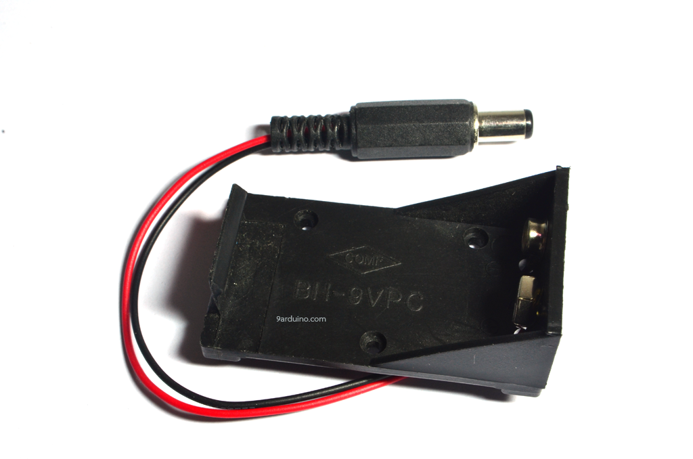
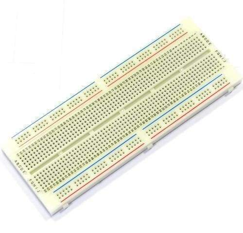
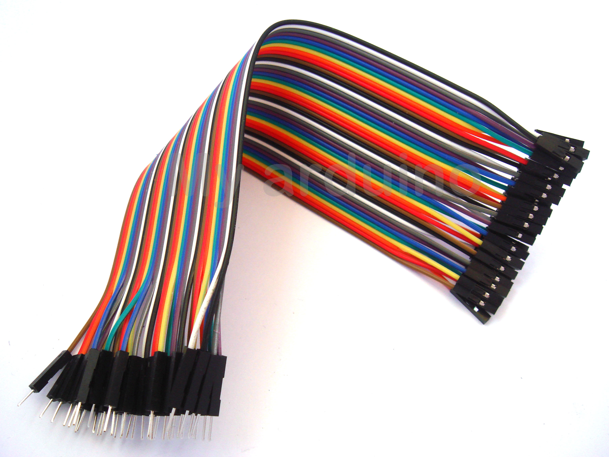
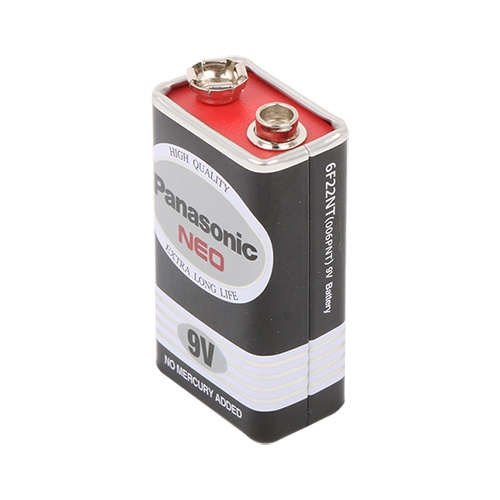

# BetterWeather-BetterHealth
&nbsp;&nbsp;&nbsp;&nbsp;&nbsp;&nbsp;&nbsp;&nbsp;เนื่องจากในปัจจุบันประเทศไทยมีสภาพอากาศที่ร้อน นอกจากนี้ยังประสบปัญหาเรื่องของมลพิษทางอากาศ ซึ่งทั้งสองปัญหานี้สามารถส่งผลต่อสุขภาพ
การใช้ชีวิตและความเป็นอยู่ของประชากร เช่น อากาศที่ร้อนจัดอาจจะทำให้เกิด Heat stroke หรือการได้รับมลพิษทางอากาศในปริมาณที่สูง อาจส่งผลกระทบต่อระบบทางเดินหายใจได้ เป็นต้น
ดังนั้นเราจึงได้จัดทำอุปกรณ์ตรวจวัดอุณหภูมิ ความชื้น และปริมาณฝุ่นในอากาศ จาก Sensor, Arduino และ nodeMCU8266 และใช้ภาษา C และ C++ ในการเขียนโปรแกรม
เพื่ออุปกรณ์นี้จะได้ช่วยในการตัดสินใจในการวางแผนการใช้ชีวิต หรือการทำกิจกรรมต่าง ๆ ในสภาพอากาศที่เหมาะสม และปลอดภัยต่อสุขภาพ
 
# Hardware

ESP8266 (NodeMCU) | Arduino Uno R3 | สาย USB Arduino | DHT11 | 20X4 LCD 
:-: | :-: | :-: | :-: | :-:
  |  |  |  | 

 GP2Y1014AU0F Dust Sensor | รางถ่าน 9V | Breadboard | สายไฟจัมเปอร์
:-: | :-: | :-: | :-:
  |  |  |  

 Power Bank | ถ่าน 9V 
:-: | :-: 
  | 

# Connection

    

# Software
 
 

# :pager: Interface
ในส่วนของการใช้งาน จะแสดงผลค่าของอุณหภูมิ ความชื้น และค่าของฝุ่นผ่านทาง LCD และจะทำการ Notify ผ่าน LINE

### ตัวอย่างการแสดงค่าผ่าน LCD

    

### ตัวอย่างการแจ้งค่าผ่าน LINE

    

# 👥Team Member
|||||
|:---:|:---:|:---:|:---:|
|[ChanyaPong](https://github.com/ChanyaPong)|[Thanaporn80](https://github.com/Thanaporn80)|[NETCHANOK61](https://github.com/NETCHANOK61)|[pawanrat11](https://github.com/pawanrat11)|
|
Chanya Chansri
:wolf:|
Thanaporn Panngam
:rabbit:|
Netchanok Petchurai
:koala:|
Pawanrat Mongkolkittham
:bear: |
 |      61070038      |      61070080      |      61070106      |      61070119      |

# Instructor

|  |  |
| :-: | :-: |
|ผศ. ดร. กิติ์สุชาต พสุภา|ผศ. ดร. ปานวิทย์ ธุวะนุติ|

# Reference

 

___

รายงานนี้เป็นส่วนหนึ่งของวิชา Computer Programming (รหัส )

คณะเทคโนโลยีสารสนเทศ สถาบันเทคโนโลยีพระจอมเกล้าเจ้าคุณทหารลาดกระบัง

___
